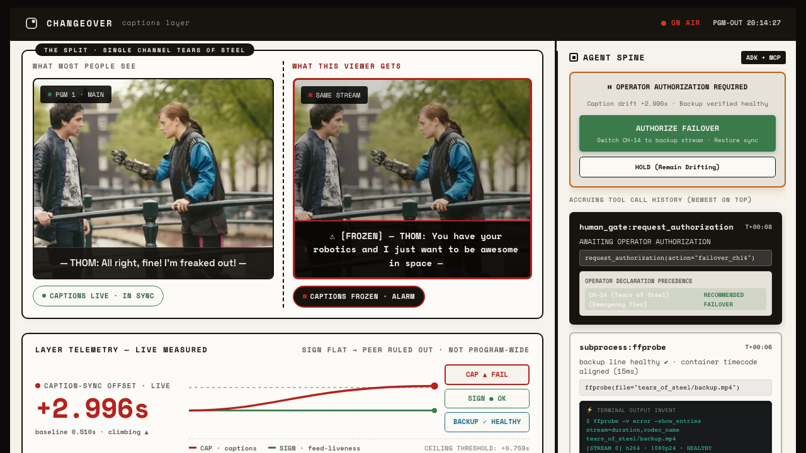

# Changeover: Autonomous AI Caption Continuity for Live Television

> **One-Sentence Thesis**: Changeover uses Google Gemini 2.5 Flash, Google ADK, and Grafana Cloud MCP to detect viewer-impacting caption failures on live broadcast channels in seconds, isolate caption-layer faults from video feed issues, arbitrate scarce backup capacity via a deterministic policy engine, and present a single-click authorization gate to a human broadcast engineer.

---

## 📺 Product Demonstration & Screenshots


*Figure 1: The Human Authorization Gate halts the incident workflow until a human broadcast engineer authorizes failover. Real PromQL sync offset (+2.996s) and Gemini diagnostic rationale are displayed on the right Agent Spine panel.*

---

## 💥 The Problem

In live television broadcasting, captions often drift or freeze silently while the primary video and audio feeds remain perfectly healthy. When a caption encoder fails, viewers who rely on closed captions suffer an immediate accessibility blackout.

Today, broadcast engineering teams must manually:
1. Notice caption drift on a wall of broadcast monitors.
2. Search Grafana observability dashboards to identify the specific faulty channel.
3. Determine whether the fault is in the caption encoder or the main video transmission.
4. Verify whether a secondary backup stream is healthy.
5. Manually switch the transmission line.

This process takes minutes, violating compliance regulations and disrupting viewer access.

---

## ⚡ What Changeover Does

Changeover is an autonomous broadcast accessibility agent that protects caption continuity:

- **Continuous Telemetry Tracking**: Monitors live caption cue sync offset (`caption_cue_sync_offset_seconds`) and feed liveness (`feed_liveness_seconds`) across channels.
- **Grafana Cloud MCP Investigation**: Queries live Prometheus metrics via Grafana Cloud HTTP proxy APIs.
- **Gemini-Powered Layer Isolation**: Evaluates telemetry evidence using **Google Gemini 2.5 Flash** to discriminate between viewer-impacting caption freeze vs. main feed video liveness faults in ~2.4 seconds.
- **Deterministic Resource Contention Arbitration**: When multiple channels fault concurrently ($N=2$) and backup capacity is scarce ($M=1$), a deterministic policy engine applies operator-declared service tiers (`Emergency/Public-Info` vs. `General Entertainment`).
- **Human Authorization Gate**: Halts execution indefinitely before hardware actuation, requiring explicit human operator approval (`operator:mark`).

---

## 🔄 Demonstrated End-to-End Flow

### Wave 1: Single-Channel Failover (Use Case 1)
1. **Healthy Baseline**: Channel 14 (*Tears of Steel*) plays with nominal caption sync offset ($+0.510\text{s}$).
2. **Caption Freeze Fault**: At `t=20.0s`, captions freeze on the right viewer while the video stream continues playing smoothly.
3. **Agent Investigation**: The agent queries Grafana Cloud MCP and invokes **Gemini 2.5 Flash**. Gemini evaluates telemetry metrics ($+2.996\text{s}$ offset) and isolates the failure to the caption layer.
4. **Backup Stream Verification**: `ffprobe` programmatically checks the secondary backup file (`backup.mp4`), confirming stream health.
5. **Human Authorization Gate**: The Agent Spine opens the Human Authorization Gate (`05_awaiting_approval`) and **halts indefinitely**.
6. **Failover Actuation**: The operator clicks **`AUTHORIZE FAILOVER`**. Source switches to backup and caption sync restores to $+0.486\text{s}$.

### Wave 2: Two-Channel Resource Contention (Use Case 2)
1. **Healthy 2-Channel Baseline**: Channel 14 (*Tears of Steel*) and Channel 27 (*Sintel*) play side-by-side.
2. **Concurrent Caption Failures**: At `T+7.5s`, caption failures occur simultaneously on both channels ($N=2$).
3. **Scarce Capacity Evaluation**: The backup pool has only $M=1$ available backup line.
4. **Deterministic Policy Priority**: The policy engine evaluates operator-declared service tiers:
   - **CH-14**: Emergency / Public-Information Tier (Priority 1) $\rightarrow$ **RECOMMENDED RESTORE**
   - **CH-27**: General Entertainment Tier (Priority 2) $\rightarrow$ **FLAG UNMITIGATED**
5. **Human Authorization Gate**: The Agent Spine presents the prioritization trade-off and halts indefinitely.
6. **Partial Mitigation**: Upon operator click, CH-14 is restored to the backup feed while CH-27 remains degraded (`PARTIALLY MITIGATED`).

---

## 🏛️ System Architecture

```
                    ┌───────────────────────────────────────────────┐
                    │          Live Broadcast Feed (HLS/MP4)        │
                    └───────────────────────┬───────────────────────┘
                                            │
                                            ▼
                    ┌───────────────────────────────────────────────┐
                    │   Prometheus Exporter & Caption Meter         │
                    └───────────────────────┬───────────────────────┘
                                            │
                                            ▼ (PromQL Remote Write)
                    ┌───────────────────────────────────────────────┐
                    │               Grafana Cloud                   │
                    └───────────────────────┬───────────────────────┘
                                            │
                                            ▼ (Model Context Protocol - MCP)
                    ┌───────────────────────────────────────────────┐
                    │           Changeover Agent Core               │
                    │         (Google Agent Dev Kit - ADK)          │
                    └───────────────────────┬───────────────────────┘
                                            │
                     ┌──────────────────────┴──────────────────────┐
                     │                                             │
                     ▼                                             ▼
       ┌──────────────────────────┐                  ┌──────────────────────────┐
       │   Google Gemini 2.5      │                  │   Deterministic Policy   │
       │   Flash (Layer Isolation)│                  │   Engine (Service Tiers) │
       └─────────────┬────────────┘                  └─────────────┬────────────┘
                     │                                             │
                     └──────────────────────┬──────────────────────┘
                                            │
                                            ▼
                    ┌───────────────────────────────────────────────┐
                    │      ⏸ HUMAN AUTHORIZATION GATE               │
                    │      (Halts indefinitely for operator)        │
                    └───────────────────────┬───────────────────────┘
                                            │ (Operator Click)
                                            ▼
                    ┌───────────────────────────────────────────────┐
                    │      Actuator Tool (Source Failover)          │
                    └───────────────────────────────────────────────┘
```

---

## 🧩 How Gemini, ADK, and Grafana Power Changeover

| Sponsor / Component | Sponsor Role | Product Consequence | Exact Implementation Path |
| :--- | :--- | :--- | :--- |
| **Grafana Cloud MCP** | **Live Observability Proxy** | Programmatically queries real PromQL sync metrics directly over HTTP proxy, eliminating manual dashboard hunting. | [`changeover/evidence/grafana_mcp.py:70-75`](file:///Users/markbrazinski/Desktop/coding%20fun/changeover-agent-cinema/changeover/evidence/grafana_mcp.py#L70-L75) |
| **Google Gemini 2.5 Flash** | **Telemetry Layer Isolation** | Evaluates raw telemetry metrics and discriminates viewer-impacting caption freeze from feed liveness faults in ~2.4s. | [`changeover/agent/diagnoser.py:76-84`](file:///Users/markbrazinski/Desktop/coding%20fun/changeover-agent-cinema/changeover/agent/diagnoser.py#L76-L84) |
| **Google ADK Pattern** | **Agent Structure & Handoff** | Packages complex telemetry evidence into a structured, single-click human authorization decision packet. | [`changeover/agent/loop.py:100-120`](file:///Users/markbrazinski/Desktop/coding%20fun/changeover-agent-cinema/changeover/agent/loop.py#L100-L120) |
| **Deterministic Policy Engine** | **Scarcity Contention Policy** | Enforces operator-declared service tiers ($M=1$ vs $N=2$) through deterministic code while keeping Gemini focused on incident synthesis. | [`changeover/contention/supervisor.py:59-65`](file:///Users/markbrazinski/Desktop/coding%20fun/changeover-agent-cinema/changeover/contention/supervisor.py#L59-L65) |

---

## ⚖️ Authority Boundaries

To ensure safe, broadcast-compliant execution:

- **Gemini does NOT assign service priority**: Priorities are dictated by operator-declared policy configurations (`CHANNELS[cid].criticality_tier`).
- **Gemini does NOT authorize failovers**: Failover execution is strictly blocked until an explicit `human_authorizer` parameter is supplied by the operator.
- **Deterministic code manages capacity**: $M=1$ backup allocation during resource contention is sorted programmatically by `ContentionSupervisor`.
- **The Human Operator owns the final action**: Hardware actuation never executes automatically.

---

## 🚀 Judge Quickstart

### Prerequisites
- **Node.js**: v18+ (tested on v20+)
- **Python**: 3.9+

### 1-Minute Launch
```bash
# 1. Install frontend & backend dependencies
npm install

# 2. Start FastAPI Backend (Port 8008)
python3 scripts/run_server.py &

# 3. Start React Frontend (Port 5173)
npm run dev
```

Open **`http://localhost:5173`** in your browser.

---

## ⌨️ Canonical Replay Shortcuts

When viewing the application UI at `http://localhost:5173`, use these single-key shortcuts:

- **Key `(1)`**: **Wave 1 Clean Demo Replay** — Starts Use Case 1 single-channel failover (no timer overlay).
- **Key `(3)`**: **Wave 1 Training Replay** — Starts Use Case 1 with timecode timer overlay.
- **Key `(2)`**: **Wave 2 Resource Contention Replay** — Launches 2-channel baseline, injects concurrent faults after 7.5s, runs real investigation, and opens the Human Authorization Gate for CH-14 vs CH-27 prioritization.

---

## 🧪 Tests & Verification

Verify the complete system using the automated test suite:

```bash
# Run Backend Unit & Integration Tests
python3 -m pytest tests/test_slice2.py tests/test_slice6.py
# Expected output: 6 passed in ~1.8s

# Run End-to-End Playwright Audit Suite (Headed/Headless Browser)
npx playwright test tests/e2e/e2e_audit.spec.ts
# Expected output: 1 passed in ~48s
```

---

## 📁 Repository Structure

```
changeover-agent-cinema/
├── changeover/                 # Python Backend Package
│   ├── action/                 # Actuator tools (backup_verifier, failover_tool)
│   ├── agent/                  # Diagnoser (Gemini 2.5 Flash) & orchestration loops
│   ├── ceilings/               # Derived safety thresholds & ceiling models
│   ├── config/                 # Channel configurations & service tiers
│   ├── contention/             # ContentionSupervisor (M<N capacity arbitration)
│   ├── evidence/               # GrafanaMCPClient & EvidenceGate
│   ├── server/                 # FastAPI server application (app.py)
│   └── telemetry/              # CaptionMeter, ProgramClock, PrometheusExporter
├── src/                        # React Frontend Application
│   ├── components/             # AgentSpine, SplitHero, EvidenceChart
│   └── App.tsx                 # Main UI & single-press keyboard shortcut orchestration
├── films/                      # Open-source video streams & WebVTT caption sidecars
├── tests/                      # Pytest unit tests & Playwright E2E audit suites
├── .env.example                # Sanitized configuration template
├── ATTRIBUTION.md              # Open-source media & library attributions
└── LICENSE                     # MIT License
```

---

## 💡 Honest Limitations

- **Simulated Hardware Switching**: In this broadcast cinema demonstration, feed failover toggles media streams on screen rather than sending SDI/IP hardware router matrix commands.
- **Predeclared Service Tiers**: Channel criticality tiers (`Emergency` vs `General`) are loaded from static configuration files (`CHANNELS`) rather than an active enterprise CMDB.
- **Deterministic Fallback**: If `GEMINI_API_KEY` is not provided or network access is offline, the agent falls back to local evidence rules to ensure uninterrupted presentation.

---

## 📜 License & Attribution

- **Code License**: [MIT License](LICENSE)
- **Media Credits**: See [ATTRIBUTION.md](ATTRIBUTION.md) for full Blender Foundation CC BY 3.0 credits (*Tears of Steel* & *Sintel*).
