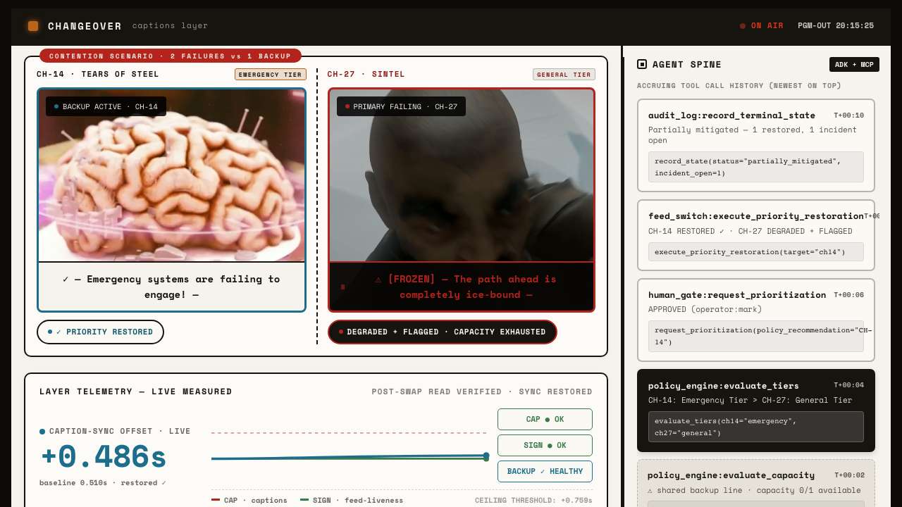

# Changeover: Autonomous AI Caption Continuity for Live Television

In live television broadcasting, closed captions silently freeze or drift out of sync while primary video feeds continue playing smoothly. Today, engineering teams manually inspect monitor walls, search Grafana dashboards, and switch hardware lines—a process taking minutes that disrupts viewer accessibility compliance. Changeover uses Google Gemini 2.5 Flash, Google ADK, and Grafana Cloud MCP to detect viewer-impacting caption failures in seconds, isolate caption-layer faults from video feed issues, arbitrate scarce backup capacity via a deterministic policy engine, and present a single-click authorization gate to a human broadcast engineer.


*Figure 1: The Human Authorization Gate halts the incident workflow until a human broadcast engineer authorizes failover. Real PromQL sync offset (+2.996s) and Gemini diagnostic rationale are displayed on the right Agent Spine panel.*


*Figure 2: Multi-channel resource contention outcome. Channel 14 restored to backup line while Channel 27 is honestly flagged as unmitigated per deterministic policy.*

## How it works

**Stage 1: Continuous Telemetry Tracking.** Changeover monitors live caption cue sync offset (`caption_cue_sync_offset_seconds`) and feed liveness (`feed_liveness_seconds`) across channels. When caption drift exceeds safety thresholds ($>0.75\text{s}$), Changeover automatically initiates an incident investigation.

**Stage 2: MCP Evidence & Gemini-Powered Layer Isolation.** The Python orchestrator queries live Prometheus metrics via official Grafana Cloud MCP (`mcp-grafana`) and passes telemetry evidence to Google Gemini 2.5 Flash via Google ADK. Gemini evaluates metrics to discriminate between viewer-impacting caption freeze vs. main feed video liveness faults, while `ffprobe` programmatically verifies secondary backup stream health.

**Stage 3: Policy Contention Arbitration & Human Authorization Gate.** When multiple channels fault concurrently ($N=2$) against scarce backup capacity ($M=1$), a deterministic policy engine applies operator-declared service tiers (`Emergency/Public-Info` vs. `General Entertainment`). The workflow halts indefinitely at the Human Authorization Gate until a broadcast operator explicitly approves the failover.

## Run it

Live Hosted Application: **[https://changeover-judge-620464070103.us-central1.run.app](https://changeover-judge-620464070103.us-central1.run.app)**

On arrival, the Changeover Broadcast Control Center loads in your browser. Click either visible header button to launch a scenario:
- **`CAPTION RECOVERY`**: Single-channel failover scenario (*Tears of Steel*). Changeover isolates a caption-layer failure, verifies the backup stream, halts at the human authorization gate, and restores caption sync upon operator approval.
- **`CAPACITY CONTENTION`**: Two-channel resource contention scenario (*Tears of Steel* + *Sintel*). Two channels experience concurrent caption faults requiring one backup line; deterministic policy presents the prioritization trade-off, the operator authorizes it, and the final state becomes `PARTIALLY MITIGATED`.

## Run locally

### Prerequisites
- **Node.js**: v18+ or v20+ (`node --version`)
- **Python**: 3.10+ or 3.11+ (`python3 --version`)
- **Official Grafana MCP**: `mcp-grafana` Go binary (`brew install mcp-grafana` or in system `PATH`)

### Install
```bash
git clone https://github.com/markbrazinski/changeover-agent-cinema.git
cd changeover-agent-cinema
npm install
python3 -m pip install -r requirements.txt
```

Verify installation with pytest unit suite:
```bash
PYTHONPATH="." python3 -m pytest tests/test_sponsor_path.py tests/test_slice2.py tests/test_slice6.py
# Expected output: 13 passed
```

### Start
```bash
# Terminal 1: Start FastAPI Backend Server (Port 8000)
PYTHONPATH="." python3 scripts/run_server.py

# Terminal 2: Start React Vite Frontend (Port 3000)
npm run dev
```

Open **`http://localhost:3000`** in your browser.

### Expected health checks
```bash
curl -s http://localhost:8000/readyz
# Observed output: {"status":"ok","mode":"ready"}

curl -s http://localhost:8000/video/manifest
# Observed output: {"channels":{"tears_of_steel":{...},"sintel":{...}}}
```

### Shutdown
Press `Ctrl+C` in Terminal 1 and Terminal 2.

## Technologies and dependencies

- **Google Gemini 2.5 Flash** — Bounded model responsibility: evidence-directed diagnosis discriminating caption-layer freeze from video feed failure.
- **Google Agent Development Kit (ADK)** — Framework structuring Gemini agent execution loops, tool schemas, and prompt context.
- **Grafana Cloud MCP (`mcp-grafana`)** — Official Go stdio MCP server providing live channel-scoped PromQL metric queries (`caption_cue_sync_offset_seconds`, `feed_liveness_seconds`).
- **Python 3.11 / FastAPI** — Backend orchestration server managing telemetry meters, backup verifiers (`ffprobe`), and deterministic contention arbitration.
- **React 18 / TypeScript / Vite / Tailwind CSS** — Broadcast cinema UI presenting side-by-side video feeds, live PromQL telemetry charts, and the Agent Spine.

## Demo

- **Live Hosted Application**: [https://changeover-judge-620464070103.us-central1.run.app](https://changeover-judge-620464070103.us-central1.run.app)
- **Source Code Repository**: [https://github.com/markbrazinski/changeover-agent-cinema](https://github.com/markbrazinski/changeover-agent-cinema)
- **Open-Source Attributions**: [ATTRIBUTION.md](ATTRIBUTION.md)

## Verification

Run local unit, integration, and browser Playwright E2E suites:

```bash
# 1. Run Python unit & sponsor integration suite
PYTHONPATH="." python3 -m pytest tests/test_sponsor_path.py tests/test_slice2.py tests/test_slice6.py
# Expected output: 13 passed

# 2. Run Playwright E2E browser qualification suite
npx playwright test tests/e2e/test_absolute_timeline.spec.ts tests/e2e/e2e_filming_and_judge_mode.spec.ts
# Expected output: 8 passed
```

## Repository structure

```
changeover-agent-cinema/
├── changeover/                 # Python Backend Package
│   ├── action/                 # Actuator tools (backup_verifier, failover_tool)
│   ├── agent/                  # Diagnoser (Gemini 2.5 Flash via ADK) & orchestration
│   ├── config/                 # Channel configurations & service tiers
│   ├── contention/             # ContentionSupervisor (M<N capacity arbitration)
│   ├── evidence/               # GrafanaMCPClient & EvidenceGate
│   └── server/                 # FastAPI server application (app.py)
├── src/                        # React Frontend Application
│   ├── components/             # AgentSpine, SplitHero, EvidenceChart
│   ├── api/                    # agentClient.ts (Real HTTP + Deterministic fallback)
│   └── App.tsx                 # Main UI, scenario controls & keyboard shortcuts
├── films/                      # Open-source video streams & WebVTT caption sidecars
├── tests/                      # Pytest unit tests & Playwright E2E audit suites
├── Dockerfile                  # Production Nginx container build for Cloud Run
└── README.md                   # Canonical product documentation
```

## Sample outputs

- **Qualification Artifact**: [logs/qualification_artifact.json](logs/qualification_artifact.json)
- **Event Contract**: [logs/event_contract.json](logs/event_contract.json)
- **Captured Screenshots**: [tests/e2e/screenshots/](tests/e2e/screenshots/)

## License

Code is licensed under the [MIT License](LICENSE).
Media assets (*Tears of Steel* & *Sintel*) are used under [CC BY 3.0](ATTRIBUTION.md).

## Honest boundaries

- **Simulated Hardware Switching**: Feed failover toggles HTML5 video elements in the UI rather than sending SDI/IP router matrix commands.
- **Predeclared Service Tiers**: Channel criticality tiers (`Emergency` vs `General`) are loaded from static configuration files (`CHANNELS`) rather than an active CMDB.
- **External Binary Requirement**: Executing live MCP queries requires the official `mcp-grafana` Go binary installed in `PATH`.
- **Local/Demo Metric Fallback**: When remote Grafana Cloud Prometheus queries are unpopulated or offline, local evidence rules ensure uninterrupted presentation and deterministic fallback.
